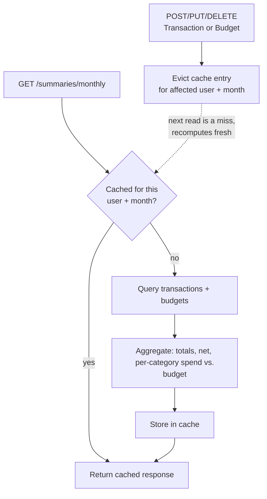

# Design Decisions

## Table of Contents

- [System Design](#system-design)
- [Key Design Decisions](#key-design-decisions)
- [REST API Design](#rest-api-design)
- [Frontend Dashboard](#frontend-dashboard)


## System Design

### 1. Relational Database over NoSQL 

In BudgetManager data is naturally relational a user has many budgets, transactions, and goals, and each of those references a category. 

Foreign keys and constraints handle that shape well, and rules like "one budget per category per user" are enforced reliably at the database level rather than only in application code.

### 2. Stateless JWT authentication, no server-side sessions

The server doesn't store any login state. Each request carries a signed token proving who the user is.

### 3. Caching

* Caching added to monthly summary endpoint, backed by Caffeine.
* Summary isn't plain row lookup, every request re-fetches user's transaction for the given month and re-computes total.
* Caffeine chosen over Redis because app runs in single instance Redis, where Redis is more efficient for multiple app instance and,
Caffeine simplifies caching flow no separate service to run or connect to. 
* If the app ever ran as multiple instances, Spring's caching abstraction makes the provider swappable without touching any `@Cacheable/@CacheEvict` code.
* A cached summary is only useful if it's never stale, so every write to `Transaction` or `Budget` evicts the specific cache entry it affects — keyed by user and month. 
Editing a transaction's date across a month boundary evicts *both* the old and new month, since both summaries are affected. 
A 10-minute expiry is also set as a backstop, in case an eviction path is ever missed.



### 4. Query Optimization

Custom queries implemented for mainly to resolve **N+1** problem, on fetching `Transaction` entities together with their associated categories.

For example, retrieving 100 transactions could potentially result in 1 query for transactions + 100 queries for categories.

Using `JOIN FETCH` that tells JPA/Hibernate to retrieve the Transaction and its associated Category in the same database query, 
avoiding separate queries for each category.

- `TransactionRepository/findAllByUserId`

```postgresql
@Query(
    value = "select t from Transaction t join fetch t.category where t.user.id = :userId",
    countQuery = "select count(t) from Transaction t where t.user.id = :userId"
)
Page<Transaction> findAllByUserId(UUID userId, Pageable pageable);
```

- `TransactionRepository/findAllByUserIdAndTransactionDateBetween`

```postgresql
@Query("""
    select t from Transaction t
    join fetch t.category
    where t.user.id = :userId
    and t.transactionDate between :start and :end
""")
List<Transaction> findAllByUserIdAndTransactionDateBetween( UUID userId, LocalDateTime start, LocalDateTime end);
```

**`join fetch t.category` Loads the related Category together with each transaction. This is the main part that helps prevent the N+1 problem.**

<br>

## Key Design Decisions

- **Categories belong to a single user, not shared globally.**

First idea was shared universal category list like Foods, Rent, Transport that will used by all the users in the app.

That was dropped to give more flexibility to each user's personal needs. 

Each category has an owner, and a user can't have two categories with the same name.

```java
// Category.java
@Table(name = "categories", uniqueConstraints = @UniqueConstraint(columnNames = {"user_id", "category_name"}))
```

- **A user can only have one budget per category.**

Two separate "Food" budgets would be ambiguous — which one applies? 
This is enforced with a database constraint, not just application logic, so it can't be bypassed.

To change a limit, you update the existing budget instead of creating a new one.

```java
// Budget.java
@Table(name = "budgets", uniqueConstraints = @UniqueConstraint(columnNames = {"user_id", "category_id"}))
```

- **Deleting a category doesn't delete your spending history.**

If a user deletes a category, any budgets or transactions that used it just become "uncategorized" instead of being deleted or blocking the deletion.

Losing a user's transaction history is worse than showing an uncategorized entry, so this was chosen over forcing the user to reassign everything first, or silently deleting their records.

```java
// Budget.java / Transaction.java
@ManyToOne(fetch = FetchType.LAZY)
@JoinColumn(name = "category_id")
@OnDelete(action = OnDeleteAction.SET_NULL)
private Category category;
```

- **Contributing to a goal adds to its progress, it doesn't replace it.**

Instead of asking the client to calculate and send a new total, the "add a contribution" endpoint takes an amount and adds it to what's already saved. 

This avoids bugs from two contributions happening close together, and matches how a user actually thinks about it

- **Shared fields (`id`, `createdAt`, `updatedAt`) live in one base class**

Inherited by every entity, instead of being repeated five times. 

Timestamps are set automatically, not manually, so they can't be forgotten or set inconsistently.

```java
// BaseEntity.java
@PrePersist
protected void onCreate() {
    createdAt = LocalDateTime.now();
    updatedAt = LocalDateTime.now();
}
```

<br>

## Rest API Design

- **Every endpoint that needs a user is scoped to the logged-in user.** 

The user's ID always comes from their token, never from something the client sends. 

A user can never read or change another user's data by guessing an ID.

```java
// CategoryController.java
public ResponseEntity<CategoryResponse> getCategory(
        @AuthenticationPrincipal CustomUserDetails principal,
        @PathVariable UUID id) {
    return ResponseEntity.ok(categoryService.getCategoryById(principal.getId(), id));
}
```
<br>

- **Ownership failures return 404, not 403.**

If you ask for a resource that exists but isn't yours, the API says "not found," not "forbidden."

A 403 would confirm the resource exists somewhere — 404 doesn't leak that information.

<br>

- **`/me` is only used for a resource a user has exactly one of.** 

The user's own profile is `/users/me`, since there's only ever one. 

Everything a user can have many of — categories, budgets, transactions, goals — uses `/{id}` instead,
with ownership checked on the server rather than baked into the URL.

<br>

- **The monthly summary defaults to the current month if none is given.**

`GET /summaries/monthly` with no parameters answers the most common question 
("how am I doing this month?") without the client needing to know today's date.

An explicit `?month=2026-08` overrides it.

## Frontend Dashboard

Frontend minimal and read-only purposes. 

Showcasing login, register flow and read-only view on user's own data.

BudgetManager project is backend focused project, the point of dashboard is showing visual changes that users done with backend.

Static files, served by the same Spring Boot app — not a separate frontend deployment. The compiled frontend lives in `src/main/resources/static/` and ships inside the same jar as the API.

One deployable unit, one URL, and no CORS configuration needed at all, since the frontend and API always share the same origin. 

Jwt stored in localstorage, this is the simplest option over using cookies which would need session-style backend changes and reintroduce CSRF handling.
Tradeoff is that by any JavaScript running on the page. For Demo purposes to show user's own data without any 3rd party involvement its acceptable.
